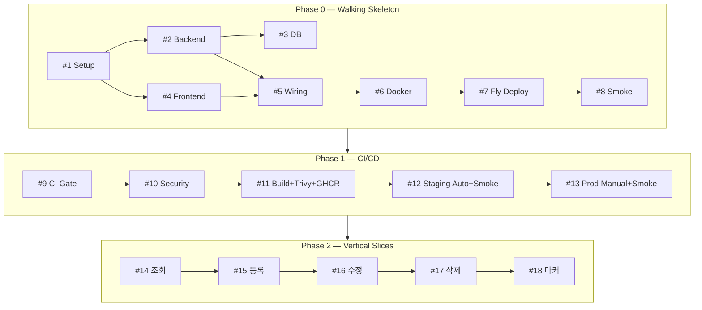

# Issues — 날짜별 할일 관리 앱 (v0.3)

> **원본 TechSpec**: todo-calendar-techspec.md (v0.3)
> **원문 PRD**: todo-calendar-prd.md
> **생성일**: 2026-04-17
> **총 이슈 수**: 18개 (L0 Walking Skeleton 8 + L1 CI/CD 5 + L2 Vertical Slice 5)
> **총 예상 소요**: 9~12일

## 이슈 층위 설명

- **L0 — Walking Skeleton (#1~#8)**: "기능은 거의 없지만 GHCR에 이미지가 올라가고 로컬 `docker run`으로 뜬다"까지의 뼈대.
- **L1 — CI/CD Pipeline (#9~#13)**: GitHub Actions 자동화. `PR → CI → main merge → GHCR 자동 push + 이미지 smoke → tag v* → :stable + Release + Pages 랜딩`.
- **L2 — Vertical Slice (#14~#18)**: 사용자 스토리 단위. 한 이슈 = DB + API + UI + Playwright E2E.

---

# Phase 0 — Walking Skeleton (L0)

## #1 [L0-Setup] 모노레포 폴더 구조 및 루트 구성

**레이블**: `L0-Setup`, `infra`
**예상 소요**: 0.25일
**의존성**: 없음

### 설명

`frontend/`, `backend/` 두 워크스페이스 구성. 추후 FE 빌드 산출물을 Express가 서빙하는 **모놀리식 컨테이너** 구조를 염두에 두고 루트 `package.json`에 공통 스크립트를 둔다.

**생성 파일**:
```
my-todo-vs/
├── package.json          # npm workspaces
├── .gitignore            # node_modules, dist, data/*.db, .env.local
├── .nvmrc                # 20
├── .dockerignore         # (#6에서 활용)
├── README.md
├── frontend/package.json # shell
└── backend/package.json  # shell
```

### 수락 기준

- [ ] `npm install` 에러 없이 완료
- [ ] `git status` 시 무시 파일이 올바르게 제외됨
- [ ] README에 "폴더 구조" + "실행법(dev/docker/배포)" 개요 섹션 포함
- [ ] `.nvmrc`에 `20` 명시

### 참고

- TechSpec §2-2 (컴포넌트 구성도), §3-1

---

## #2 [L0-Backend] Express 서버 + `/api/health` 엔드포인트

**레이블**: `L0-Backend`, `infra`
**예상 소요**: 0.25일
**의존성**: Depends on #1

### 설명

Express 인스턴스와 `GET /api/health` 하나만 노출. **Fly.io health check가 이 엔드포인트를 찌를 것**이므로 version/timestamp를 함께 반환한다.

**응답**:
```json
{ "status": "ok", "timestamp": "2026-04-17T12:34:56Z", "version": "<git-sha or 'dev'>" }
```

- `version`은 환경변수 `GIT_SHA`에서 읽고, 없으면 `'dev'`
- `src/app.js`는 app 인스턴스 export (Supertest용)

### 수락 기준

- [ ] `npm run dev --workspace=backend` 기동 시 포트 3000 listen
- [ ] `curl localhost:3000/api/health` → 200 + JSON
- [ ] Supertest로 health 응답 형식 검증
- [ ] `helmet`, `express.json({ limit: '10kb' })` 미들웨어 적용

### 참고

- TechSpec §5-3, §6-2

---

## #3 [L0-DB] SQLite 연결 + DDL + `DB_PATH` 환경변수

**레이블**: `L0-DB`, `infra`
**예상 소요**: 0.5일
**의존성**: Depends on #2

### 설명

better-sqlite3로 DB 초기화. **경로를 환경변수 `DB_PATH`로 주입**받도록 설계해야 로컬(`./data/todo.db`)과 Fly Volume(`/app/data/todo.db`) 둘 다 동일 코드로 동작함.

**구성**:
```
backend/
├── data/                 # .gitignore
└── src/db/
    ├── index.js          # better-sqlite3 싱글톤, process.env.DB_PATH || './data/todo.db'
    └── schema.sql        # CREATE TABLE todos + INDEX
```

### 수락 기준

- [ ] 서버 부팅 시 `todos` 테이블 자동 생성
- [ ] `DB_PATH=/tmp/test.db npm start`로 경로 변경 동작 확인
- [ ] 중복 실행 시 에러 없음 (`IF NOT EXISTS`)
- [ ] Jest: DB 연결 + 테이블 존재 테스트

### 참고

- TechSpec §4, §6-2 (환경변수)

---

## #4 [L0-Frontend] Vite + React + Tailwind + Hello 페이지

**레이블**: `L0-Frontend`, `infra`
**예상 소요**: 0.25일
**의존성**: Depends on #1

### 설명

Vite + React 18 + Tailwind v3. 빌드 산출물(`dist/`)을 나중에 Express가 서빙할 것이므로 base path 고려.

### 수락 기준

- [ ] `npm run dev --workspace=frontend` → `http://localhost:5173` Hello 페이지
- [ ] Tailwind 클래스가 시각적으로 적용됨
- [ ] `npm run build --workspace=frontend` → `dist/` 생성

### 참고

- TechSpec §3-1, §7

---

## #5 [L0-Wiring] Express가 빌드된 SPA 서빙 + `/api/health` 연동

**레이블**: `L0-Wiring`, `infra`
**예상 소요**: 0.5일
**의존성**: Depends on #2, #4

### 설명

프로덕션에서는 **Express가 `frontend/dist`를 정적 파일로 서빙**한다(CORS 불필요 = same-origin). 개발 모드만 Vite proxy로 분리.

**구현 포인트**:
- `backend/src/app.js`: `app.use(express.static(path.join(__dirname, '../../frontend/dist')))`
- SPA 라우팅 fallback: `app.get('*', (req, res) => res.sendFile('index.html'))` — 단, `/api/*`는 제외
- 개발 모드: Vite proxy `/api → localhost:3000`
- 루트 `npm run build`: FE 빌드 → BE 시작 순서

**App.jsx** — `/api/health` 호출 후 timestamp 표시

### 수락 기준

- [ ] `npm run build && npm start` → `http://localhost:3000` 에서 SPA + API 모두 동작
- [ ] FE는 `/api/health` same-origin 호출 (CORS 에러 없음)
- [ ] `npm run dev` 모드도 여전히 동작 (Vite proxy 경유)

### 참고

- TechSpec §2-1 (Containerized Monolith), §6-2

---

## #6 [L0-Docker] Dockerfile + docker-compose + 로컬 컨테이너 실행

**레이블**: `L0-Docker`, `infra`
**예상 소요**: 0.5일
**의존성**: Depends on #5

### 설명

멀티 스테이지 Dockerfile 작성 — **build 스테이지**에서 FE 빌드, **runtime 스테이지**에서 Node 20 + 빌드 산출물만 복사. `docker-compose.yml`로 로컬에서도 한 번에 기동.

**Dockerfile 구조**:
```dockerfile
# stage 1: build
FROM node:20-alpine AS build
WORKDIR /app
COPY package*.json ./
COPY frontend/package*.json ./frontend/
COPY backend/package*.json ./backend/
RUN npm ci
COPY . .
RUN npm run build --workspace=frontend

# stage 2: runtime
FROM node:20-alpine
WORKDIR /app
COPY --from=build /app/node_modules ./node_modules
COPY --from=build /app/backend ./backend
COPY --from=build /app/frontend/dist ./frontend/dist
COPY --from=build /app/package*.json ./
ENV NODE_ENV=production PORT=8080 DB_PATH=/app/data/todo.db
VOLUME /app/data
EXPOSE 8080
CMD ["node", "backend/src/index.js"]
```

**docker-compose.yml**: 이미지 빌드 + 볼륨 마운트 + 포트 매핑

### 수락 기준

- [ ] `docker build -t todo-app .` 성공
- [ ] `docker-compose up` → `http://localhost:8080`에서 앱 동작
- [ ] `data/todo.db`가 호스트 볼륨에 영속 저장됨
- [ ] 이미지 크기 200MB 이하 (multi-stage 효과 검증)
- [ ] README에 로컬 Docker 실행법 추가

### 참고

- TechSpec §2-1, §3-3, §4-4

---

## #7 [L0-GHCR] 최초 수동 `docker push` + GHCR 이미지 public 전환

**레이블**: `L0-GHCR`, `infra`
**예상 소요**: 0.5일
**의존성**: Depends on #6

### 설명

빌드된 이미지를 **GitHub Container Registry(ghcr.io)에 수동으로 최초 push**하고, 패키지를 **public**으로 전환하여 누구나 `docker pull` 가능하게 한다. CI에서 자동 push하는 건 #11에서.

**작업 절차**:
1. GitHub Personal Access Token 생성 (`write:packages`, `read:packages` scope)
2. `echo $CR_PAT | docker login ghcr.io -u ischung --password-stdin`
3. 이미지 태그 지정: `docker tag todo-app ghcr.io/ischung/my-todo-vs:v0.0.1`
4. `docker push ghcr.io/ischung/my-todo-vs:v0.0.1`
5. GitHub → Packages → `my-todo-vs` → Settings → **Change visibility → Public**
6. Packages에서 리포지토리 연결(`Connect repository`) 설정

**README 추가**: 사용자가 직접 실행하는 방법
```bash
docker pull ghcr.io/ischung/my-todo-vs:v0.0.1
docker run -d -p 8080:8080 -v ./data:/app/data ghcr.io/ischung/my-todo-vs:v0.0.1
open http://localhost:8080
```

### 수락 기준

- [ ] `https://github.com/users/ischung/packages/container/my-todo-vs` 접근 가능(public)
- [ ] 제3자 계정(또는 로그아웃 상태)에서 `docker pull ghcr.io/ischung/my-todo-vs:v0.0.1` 성공
- [ ] 패키지와 리포지토리가 연결되어 README/Description 노출
- [ ] README에 pull/run 가이드 한 섹션 추가
- [ ] CR_PAT는 **개인 노트에만** 보관, 리포지토리에 커밋 금지

### 참고

- TechSpec §2-3, §3-3 (배포 & 인프라)

---

## #8 [L0-E2E] Playwright Smoke — 로컬 `docker run` 대상

**레이블**: `L0-E2E`, `test`
**예상 소요**: 0.5일
**의존성**: Depends on #7

### 설명

Playwright를 설치하고, **GHCR에서 pull한 이미지를 로컬에서 띄워** 실제 `docker run` 대상으로 smoke test를 실행한다. `baseURL`은 환경변수로 주입하여 개발 서버/컨테이너/CI 모두 같은 스펙 재사용 가능.

**파일**:
```
e2e/
├── package.json          # @playwright/test
├── playwright.config.js  # baseURL: process.env.E2E_BASE_URL || 'http://localhost:8080'
└── tests/smoke.spec.js
```

**smoke.spec.js**:
```javascript
test('@smoke 앱이 살아있다', async ({ page }) => {
  await page.goto('/');
  await expect(page.getByText(/서버 연결 OK/)).toBeVisible({ timeout: 10000 });
});

test('@smoke health 엔드포인트', async ({ request }) => {
  const res = await request.get('/api/health');
  expect(res.status()).toBe(200);
  const body = await res.json();
  expect(body.status).toBe('ok');
});
```

**검증 스크립트** (`scripts/smoke-local.sh`):
```bash
docker pull ghcr.io/ischung/my-todo-vs:v0.0.1
CID=$(docker run -d -p 8080:8080 ghcr.io/ischung/my-todo-vs:v0.0.1)
trap "docker stop $CID && docker rm $CID" EXIT
# wait for health
for i in {1..30}; do curl -sf http://localhost:8080/api/health && break; sleep 1; done
E2E_BASE_URL=http://localhost:8080 npx playwright test --grep @smoke
```

### 수락 기준

- [ ] `bash scripts/smoke-local.sh` 실행 시 smoke 2개 통과
- [ ] Chromium 단일 브라우저
- [ ] HTML 리포트 생성
- [ ] 일부러 잘못된 태그를 pull해 실행 시 smoke 실패
- [ ] 실행 후 컨테이너 정리됨 (`docker ps`에 잔존 없음)

### 참고

- TechSpec §3-2, §8-1

---

# Phase 1 — CI/CD Pipeline (L1)

## #9 [L1-CI-Gate] GitHub Actions — Lint + Unit Test (PR 게이트)

**레이블**: `L1-CI`, `infra`
**예상 소요**: 0.5일
**의존성**: Depends on #8

### 설명

PR·push 시 자동 실행되어 **머지 전 lint와 단위 테스트를 강제**하는 게이트. 파이프라인의 첫 번째 단계.

**파일**: `.github/workflows/ci.yml`

```yaml
name: CI
on:
  pull_request:
  push:
    branches: [main]

jobs:
  lint:
    runs-on: ubuntu-latest
    steps:
      - uses: actions/checkout@v4
      - uses: actions/setup-node@v4
        with: { node-version-file: '.nvmrc', cache: 'npm' }
      - run: npm ci
      - run: npm run lint

  test:
    runs-on: ubuntu-latest
    steps:
      - uses: actions/checkout@v4
      - uses: actions/setup-node@v4
        with: { node-version-file: '.nvmrc', cache: 'npm' }
      - run: npm ci
      - run: npm test --workspaces --if-present
```

**Branch Protection Rule** (GitHub 설정):
- `main`: `lint`, `test` 통과 + 1 review 필수

### 수락 기준

- [ ] PR 생성 시 두 job 자동 실행
- [ ] 일부러 lint 에러가 있는 PR은 머지 버튼 비활성
- [ ] main 브랜치 보호 규칙 설정됨
- [ ] README에 CI 배지 추가

### 참고

- TechSpec §8-1, §8-2

---

## #10 [L1-Security] Security Scan — npm audit + CodeQL + Dependabot

**레이블**: `L1-Security`, `infra`
**예상 소요**: 0.5일
**의존성**: Depends on #9

### 설명

3가지 보안 스캔을 조합:
1. **npm audit**: 의존성 취약점 CI 단계에서 체크
2. **CodeQL**: GitHub 기본 SAST, 주간 스케줄 + PR 트리거
3. **Dependabot**: 주간 의존성 업데이트 PR 자동 생성

**파일**:
- `.github/workflows/codeql.yml` (GitHub 기본 템플릿)
- `.github/dependabot.yml`:
  ```yaml
  version: 2
  updates:
    - package-ecosystem: "npm"
      directory: "/"
      schedule: { interval: "weekly" }
    - package-ecosystem: "github-actions"
      directory: "/"
      schedule: { interval: "weekly" }
  ```
- `ci.yml`의 `test` job에 `npm audit --audit-level=high` 추가 (high/critical만 차단)

### 수락 기준

- [ ] CodeQL 워크플로우가 main push 시 실행됨 (Security 탭에서 결과 확인)
- [ ] Dependabot이 최소 1건의 업데이트 PR을 자동 생성 (일반적으로 설정 후 24h 내)
- [ ] `npm audit --audit-level=high` 통과 (high 이상 취약점 없음)
- [ ] README에 보안 스캔 개요 1단락

### 참고

- TechSpec §3-3, §8-2

---

## #11 [L1-Build] Docker Build + Trivy 스캔 + GHCR Push

**레이블**: `L1-Build`, `infra`
**예상 소요**: 0.75일
**의존성**: Depends on #10

### 설명

main에 push될 때 Docker 이미지를 빌드해 Trivy로 CVE 스캔 후 GitHub Container Registry(`ghcr.io`)에 push. 태그는 **git SHA + `latest`** 병용.

**파일**: `.github/workflows/build-and-deploy.yml` (일부, staging deploy는 #12에서 이어받음)

```yaml
name: Build & Deploy
on:
  push:
    branches: [main]

jobs:
  build:
    runs-on: ubuntu-latest
    permissions: { contents: read, packages: write }
    outputs:
      image: ${{ steps.meta.outputs.tags }}
    steps:
      - uses: actions/checkout@v4
      - uses: docker/setup-buildx-action@v3
      - uses: docker/login-action@v3
        with:
          registry: ghcr.io
          username: ${{ github.actor }}
          password: ${{ secrets.GITHUB_TOKEN }}
      - id: meta
        uses: docker/metadata-action@v5
        with:
          images: ghcr.io/${{ github.repository }}/todo
          tags: |
            type=sha
            type=raw,value=latest
      - uses: docker/build-push-action@v5
        with:
          context: .
          push: true
          tags: ${{ steps.meta.outputs.tags }}
          build-args: GIT_SHA=${{ github.sha }}
      - name: Trivy scan
        uses: aquasecurity/trivy-action@master
        with:
          image-ref: ghcr.io/${{ github.repository }}/todo:sha-${{ github.sha }}
          severity: 'HIGH,CRITICAL'
          exit-code: '1'
```

### 수락 기준

- [ ] main push 시 이미지가 `ghcr.io/<user>/<repo>/todo:sha-…` 및 `:latest`로 push됨
- [ ] Trivy가 HIGH 이상 CVE 발견 시 빌드 실패
- [ ] 이미지 크기 <250MB (multi-stage)
- [ ] 패키지 탭에서 이미지 버전 목록 확인 가능

### 참고

- TechSpec §2-2, §3-3, §8-1

---

## #12 [L1-ImageSmoke] CI 러너에서 Image Pull + Run + Playwright Smoke

**레이블**: `L1-ImageSmoke`, `infra`, `test`
**예상 소요**: 0.75일
**의존성**: Depends on #11

### 설명

`build.yml`의 build job이 GHCR에 push를 끝낸 직후, **같은 러너에서 이미지를 pull해 컨테이너를 띄우고** Playwright smoke test를 돌린다. 실패 시 방금 push된 `:latest` 태그를 직전 sha로 재지정(롤백)한다.

**workflow 추가 job** (`build.yml`):
```yaml
  image-smoke:
    needs: build
    runs-on: ubuntu-latest
    permissions: { packages: read, contents: read }
    steps:
      - uses: actions/checkout@v4
      - uses: actions/setup-node@v4
        with: { node-version-file: '.nvmrc', cache: 'npm' }
      - run: npm ci --workspace=e2e
      - uses: docker/login-action@v3
        with:
          registry: ghcr.io
          username: ${{ github.actor }}
          password: ${{ secrets.GITHUB_TOKEN }}
      - name: Run container
        run: |
          docker run -d --name todo-smoke -p 8080:8080 \
            ghcr.io/${{ github.repository }}:sha-${{ github.sha }}
          for i in {1..30}; do curl -sf http://localhost:8080/api/health && break; sleep 1; done
      - run: npx playwright install --with-deps chromium
        working-directory: e2e
      - run: npx playwright test --grep @smoke
        working-directory: e2e
        env: { E2E_BASE_URL: http://localhost:8080 }
      - if: always()
        run: docker logs todo-smoke || true
      - if: always()
        run: docker stop todo-smoke && docker rm todo-smoke

  rollback-latest:
    needs: image-smoke
    if: failure()
    runs-on: ubuntu-latest
    permissions: { packages: write }
    steps:
      - name: Retag :latest to previous sha
        run: |
          # find previous :sha-* tag and retag :latest to point there
          docker buildx imagetools create \
            -t ghcr.io/${{ github.repository }}:latest \
            ghcr.io/${{ github.repository }}:sha-<이전 sha>
```

### 수락 기준

- [ ] main merge 시 image-smoke job이 자동 실행
- [ ] Playwright `@smoke`만 실행하여 2분 이내 완료
- [ ] 의도적으로 API 버그를 넣은 커밋으로 smoke가 실패함을 확인
- [ ] smoke 실패 후 `:latest`가 이전 정상 sha로 복원됨
- [ ] `docker logs todo-smoke` 출력이 workflow log에 포함됨 (디버깅)

### 참고

- TechSpec §8-1, §8-4

---

## #13 [L1-Release] Release 자동화 — `:stable` 태그 + GitHub Release + Pages 랜딩 갱신

**레이블**: `L1-Release`, `infra`
**예상 소요**: 0.75일
**의존성**: Depends on #12

### 설명

`git tag v*` 또는 `workflow_dispatch`로 실행되는 릴리스 자동화. 3가지를 함께 수행:
1. GHCR의 해당 sha 이미지를 `:stable` 및 `:v1.2.3`으로 **retag** (재빌드 없이)
2. **GitHub Release 생성** + CHANGELOG 첨부
3. **GitHub Pages 랜딩 페이지 갱신** (현재 버전 + `docker pull` 명령 반영)

**파일**: `.github/workflows/release.yml`

```yaml
name: Release
on:
  push:
    tags: ['v*']
  workflow_dispatch:
    inputs:
      version:
        description: 'Version tag (e.g. v1.0.0)'
        required: true

permissions:
  contents: write    # for creating Release
  packages: write    # for retagging image
  pages: write       # for Pages deployment
  id-token: write    # for Pages

jobs:
  retag:
    runs-on: ubuntu-latest
    steps:
      - uses: docker/login-action@v3
        with:
          registry: ghcr.io
          username: ${{ github.actor }}
          password: ${{ secrets.GITHUB_TOKEN }}
      - name: Retag image to :stable and :version
        run: |
          SHA_TAG="ghcr.io/${{ github.repository }}:sha-${{ github.sha }}"
          VER="${{ github.event.inputs.version || github.ref_name }}"
          docker buildx imagetools create -t "ghcr.io/${{ github.repository }}:stable" "$SHA_TAG"
          docker buildx imagetools create -t "ghcr.io/${{ github.repository }}:$VER" "$SHA_TAG"

  github-release:
    needs: retag
    runs-on: ubuntu-latest
    steps:
      - uses: actions/checkout@v4
        with: { fetch-depth: 0 }
      - name: Generate changelog
        id: changelog
        run: |
          PREV_TAG=$(git describe --tags --abbrev=0 HEAD^ 2>/dev/null || echo "")
          echo "## Changes" > NOTES.md
          git log ${PREV_TAG:+$PREV_TAG..}HEAD --pretty=format:"- %s" >> NOTES.md
      - uses: softprops/action-gh-release@v2
        with:
          body_path: NOTES.md
          name: Release ${{ github.ref_name }}
          tag_name: ${{ github.ref_name }}

  pages:
    needs: retag
    runs-on: ubuntu-latest
    environment: github-pages
    steps:
      - uses: actions/checkout@v4
      - name: Generate landing page
        run: |
          mkdir -p _site
          VER="${{ github.ref_name }}"
          sed "s/__VERSION__/$VER/g" docs/landing.template.html > _site/index.html
      - uses: actions/upload-pages-artifact@v3
        with: { path: _site }
      - uses: actions/deploy-pages@v4
```

**랜딩 페이지 템플릿** (`docs/landing.template.html`): 프로젝트 소개 + `docker pull ghcr.io/ischung/my-todo-vs:__VERSION__` 한 줄 복사 버튼 + 스크린샷

### 수락 기준

- [ ] `git tag v0.1.0 && git push --tags` 실행 시 3개 job(retag, github-release, pages) 모두 통과
- [ ] GHCR에 `:stable`, `:v0.1.0` 태그가 동일 digest를 가짐 (`docker buildx imagetools inspect`로 확인)
- [ ] `https://github.com/ischung/my-todo-vs/releases`에 Release와 changelog 게시
- [ ] `https://ischung.github.io/my-todo-vs/`에 현재 버전이 반영된 랜딩 페이지 표시
- [ ] `workflow_dispatch`로도 동일하게 실행됨

### 참고

- TechSpec §8-1, §8-2, §8-4

---

# Phase 2 — Vertical Slices (L2)

## #14 [VS] 사용자는 캘린더에서 날짜를 선택하여 그날의 할일 목록을 본다

**레이블**: `vertical-slice`, `feature`
**예상 소요**: 1.5일
**의존성**: Depends on #13 (Phase 0+1 완료)

### 설명

첫 번째 가치 증분. DB에 seed 데이터 주입, 조회 API, 캘린더 UI, E2E까지 한 이슈에. 이 이슈가 머지되면 **staging에 자동 배포되어 실제로 조회가 가능**해진다.

### 구현 내용

**DB**: `backend/scripts/seed.js` — 오늘·내일·어제에 샘플 2~3개 (dev 전용)

**API**: `GET /api/todos?date=YYYY-MM-DD`
- 검증: 날짜 형식 (`/^\d{4}-\d{2}-\d{2}$/`) — 400 처리
- Supertest: happy path + 400

**Frontend**:
- `Calendar` 컴포넌트 (Header: ◀ 2026년 4월 ▶, Grid: 7×6)
- `TodoPanel` (조회 전용 — 완료 토글·편집은 #16)
- `EmptyState`: "이 날짜에는 아직 할일이 없어요..."
- 오늘 강조: `ring-2 ring-blue-500`

**E2E** (`e2e/tests/view-todos.spec.js`, `@feature`):
1. 앱 진입 → 오늘 강조
2. 오늘 탭 → seed 할일 표시
3. 이전 달 버튼 → 월 변경
4. 빈 날짜 → EmptyState

### 수락 기준

- [ ] `GET /api/todos?date=...` Supertest 2개 통과 (정상/400)
- [ ] 오늘 날짜가 시각적으로 강조됨
- [ ] 날짜 탭 시 500ms 이내 목록 갱신
- [ ] 월 이동 버튼 동작
- [ ] Playwright 4개 시나리오 통과 (staging에서도)
- [ ] staging 배포 후 수동 확인

### 참고

- TechSpec §5, §6-1, PRD §5.1

---

## #15 [VS] 사용자는 선택한 날짜에 새 할일을 등록한다

**레이블**: `vertical-slice`, `feature`
**예상 소요**: 1일
**의존성**: Depends on #14

### 설명

"+ 할일 추가" → 입력 → 저장 → 목록 반영.

### 구현 내용

**API**: `POST /api/todos`
- 바디: `{ title, date }`
- 검증: title 1~100자, date 형식
- 201 + Todo 객체 / 400

**Frontend**: `TodoInput` — 버튼·입력·Enter 저장·실패 토스트(2초)

**E2E** (`add-todo.spec.js`, `@feature`):
1. 추가 → 목록 반영
2. 빈 입력 → 저장 비활성
3. 새로고침 → 영속 확인
4. 500 에러(목킹) → 토스트

### 수락 기준

- [ ] Supertest: 201, 400 (길이 0/101) 3개
- [ ] 빈 입력 시 저장 disabled
- [ ] 실패 시 토스트 2초
- [ ] Playwright 4개 통과

### 참고

- TechSpec §5-3, PRD §5.2

---

## #16 [VS] 사용자는 할일의 제목을 수정하거나 완료 여부를 토글한다

**레이블**: `vertical-slice`, `feature`
**예상 소요**: 1일
**의존성**: Depends on #15

### 설명

항목 탭 → 인라인 편집 / 체크박스 → 완료 토글.

### 구현 내용

**API**: `PATCH /api/todos/:id` — `{ title? }` 또는 `{ completed? }` — 200/404/400

**Frontend**: `TodoItem` 확장 — inline edit(Enter 저장, Esc 취소, blur 저장), 체크박스 즉시 PATCH, 완료 시 `line-through text-gray-400`

**E2E**:
1. 제목 수정
2. 체크박스 토글 → 취소선
3. 다시 토글 → 해제
4. 빈 제목 저장 시도 → 에러

### 수락 기준

- [ ] Supertest 4개 (title 수정/completed 토글/404/400)
- [ ] inline edit + 체크박스 동작
- [ ] 빈 제목 저장 방지
- [ ] Playwright 4개 통과

### 참고

- TechSpec §5-3, §7-1, PRD §5.3

---

## #17 [VS] 사용자는 할일을 삭제한다 (확인 다이얼로그)

**레이블**: `vertical-slice`, `feature`
**예상 소요**: 0.75일
**의존성**: Depends on #16

### 설명

쓰레기통 → `window.confirm` → DELETE.

### 구현 내용

**API**: `DELETE /api/todos/:id` — 204 / 404

**Frontend**: 삭제 아이콘(`aria-label="삭제"`) → confirm → DELETE → 실패 시 토스트

**E2E**:
1. 확인 → 제거
2. 취소 → 유지 (Network tab으로 DELETE 미호출 확인)
3. 새로고침 후에도 삭제 상태
4. 접근성: `aria-label` 확인

### 수락 기준

- [ ] Supertest: 204, 404 2개
- [ ] confirm 취소 시 API 미호출
- [ ] `aria-label="삭제"` 존재
- [ ] Playwright 4개 통과

### 참고

- TechSpec §5-3, §7-5, PRD §5.4

---

## #18 [VS] 사용자는 캘린더에서 할일이 있는 날짜를 점(dot)으로 구분한다

**레이블**: `vertical-slice`, `feature`
**예상 소요**: 0.5일
**의존성**: Depends on #17

### 설명

월 단위 집계 API + 캘린더 셀 하단 점 표시.

### 구현 내용

**API**: `GET /api/todos/dates?year=&month=` — `["2026-04-03", ...]`

**Frontend**: `markedDates` 상태, `DayCell`에 점, 추가/삭제 시 로컬 갱신

**E2E**:
1. 진입 시 seed 날짜에 점
2. 추가 → 점 생김
3. 마지막 할일 삭제 → 점 사라짐
4. 이전 달 이동 → 점 재로드

### 수락 기준

- [ ] Supertest: 날짜 배열 반환
- [ ] 점 시각 스펙 충족 (파란 1~2px, 하단 중앙)
- [ ] 추가/삭제 즉시 반영
- [ ] Playwright 4개 통과

### 참고

- TechSpec §5-3, §6-1, PRD §6

---

## 📎 부록

### 이슈 실행 순서 요약



### 총 소요

| Phase | 이슈 | 소요 |
|-------|------|------|
| L0 Walking Skeleton | #1~#8 | 3.25일 |
| L1 CI/CD Pipeline | #9~#13 | 3일 |
| L2 Vertical Slice | #14~#18 | 4.75일 |
| **합계** | **18개** | **11일** |

### 용어
- **Walking Skeleton**: 기능은 최소지만 배포·테스트·CI 전 층을 관통하는 뼈대
- **Vertical Slice**: DB → API → UI → E2E를 한 이슈에 묶어 "사용자 가치 1개"가 생기는 단위
- **CI Gate**: 머지 전 반드시 통과해야 할 자동 검증 단계
- **Smoke Test**: 배포 직후 "핵심 페이지가 뜨는가"만 확인하는 최소 E2E
