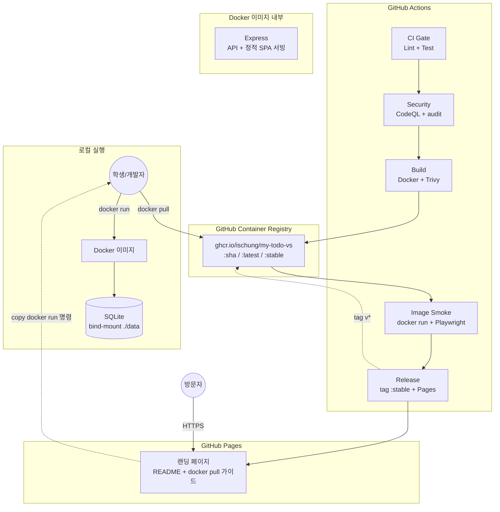
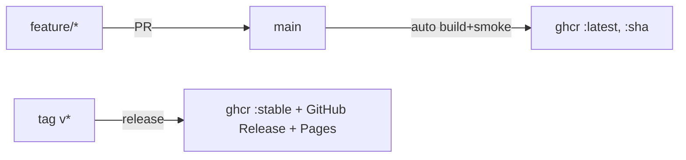
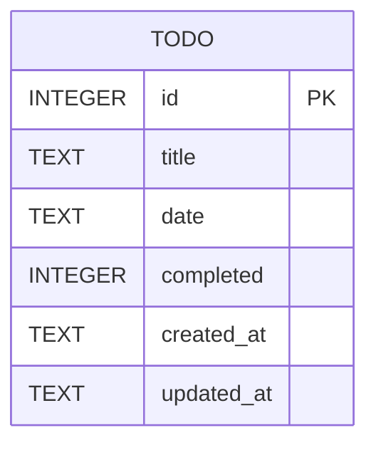
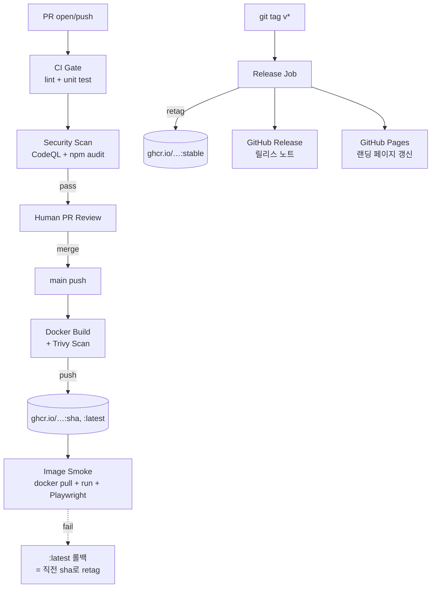

# Tech Spec: 날짜별 할일 관리 앱

## 1. 문서 정보

| 항목 | 내용 |
|------|------|
| **작성일** | 2026-04-17 |
| **상태** | Draft |
| **버전** | v0.3 |
| **원문 PRD** | todo-calendar-prd.md |

---

## 2. 시스템 아키텍처

### 2-1. 아키텍처 패턴

| 패턴 | 선택 이유 |
|------|-----------|
| **3-tier Layered Architecture** | 클라이언트/서버/DB 경계가 명확해 책임 분리(SoC)를 학습에 적합하게 보여줌 |
| **REST API** | 표준 HTTP 메서드와 자원 중심 설계로 구현·이해 모두 단순 |
| **Containerized Monolith** | Express가 빌드된 SPA + API를 한 컨테이너에서 서빙. CORS·도메인 관리를 단일화 |
| **GitHub-native Distribution** (v0.3) | Docker 이미지를 GHCR로 배포(registry-as-release), FE+BE는 동일 이미지에 포함. 별도 호스팅 서버 없이 **사용자가 로컬에서 `docker run`**. GitHub Pages는 랜딩·사용법 페이지 역할 |

### 2-2. 컴포넌트 구성도



### 2-3. 배포 환경 (2단계, GHCR 기반)

| 환경 | 형태 | 위치 | 트리거 | 데이터 |
|------|------|------|--------|--------|
| **dev** | 로컬 `docker-compose up` 또는 `npm run dev` | `http://localhost:8080` | - | `./data/todo.db` (bind mount) |
| **released** | GHCR 이미지 (사용자 로컬에서 `docker run`) | `ghcr.io/ischung/my-todo-vs:sha` / `:latest` / `:stable` | main merge + release tag | 사용자 호스트 볼륨 |

**배포 대상 = 컨테이너 이미지 그 자체.** Fly.io 같은 실 호스팅 서버는 없으며, GitHub Pages는 랜딩 페이지 용도.

**Git 전략**: GitHub Flow (`main` 보호 + feature 브랜치 + PR 머지)



---

## 3. 기술 스택

### 3-1. 애플리케이션

| 분류 | 기술 | 버전 | 선정 이유 |
|------|------|------|-----------|
| 언어 | JavaScript (ES2022) | — | TypeScript 대비 빌드·타입 설정 부담 없음 |
| Frontend Framework | React | 18.x | 사용자 지정 |
| Build Tool | Vite | 5.x | 설정 최소, 빠른 HMR |
| 스타일링 | Tailwind CSS | 3.x | 유틸리티 클래스로 CSS 파일 분리 불필요 |
| 상태 관리 | React Hooks | — | 외부 라이브러리 0개 |
| HTTP 클라이언트 | fetch API | native | 추가 의존성 없음 |
| 날짜 처리 | 내장 `Date` | — | 순수 JS로 충분 |
| Backend Framework | Express | 4.x | Node.js 표준 |
| DB 드라이버 | better-sqlite3 | 11.x | 동기 API — async 복잡도 제거 |
| Database | SQLite | 3.x | 별도 서버 불필요, 볼륨에 파일 저장 |

### 3-2. 테스트 & 품질

| 분류 | 기술 | 역할 |
|------|------|------|
| 테스트 (FE) | Vitest | 컴포넌트 단위 테스트 |
| 테스트 (BE) | Jest + Supertest | API 단위/통합 테스트 |
| 테스트 (E2E) | Playwright | 배포된 staging/prod URL 대상 smoke/E2E |
| Lint/Format | ESLint + Prettier | 코드 품질 |

### 3-3. 배포 & 인프라 (v0.3 — GitHub 생태계 한정)

| 분류 | 기술 | 역할 |
|------|------|------|
| 컨테이너 | Docker | 이미지 빌드, 로컬 dev, 배포 표준화 |
| 로컬 오케스트레이션 | Docker Compose | `docker-compose up`으로 dev 환경 기동 |
| 컨테이너 레지스트리 | GitHub Container Registry (ghcr.io) | **배포물(아티팩트) 저장소 겸 "릴리스 타깃"** |
| 랜딩 페이지 | GitHub Pages | `docker pull/run` 가이드 + 프로젝트 소개 (정적 HTML) |
| SAST | CodeQL | 코드 정적 분석 |
| 의존성 스캔 | `npm audit` + Dependabot | 취약점 감지 및 자동 PR |
| 컨테이너 스캔 | Trivy | 이미지 CVE 스캔 |
| Secrets 관리 | GitHub Actions Secrets | `GITHUB_TOKEN`만 사용 (외부 토큰 0개) |

---

## 4. 데이터 모델

### 4-1. 엔티티 정의

할일(Todo)은 단일 엔티티만 존재한다. 사용자 개념이 없으므로 외래키도 없다.

```javascript
/**
 * @typedef {Object} Todo
 * @property {number} id           - 자동 증가 기본키
 * @property {string} title        - 할일 제목 (1~100자)
 * @property {string} date         - "YYYY-MM-DD" 형식 날짜
 * @property {boolean} completed   - 완료 여부
 * @property {string} createdAt    - ISO 8601 생성 시각
 * @property {string} updatedAt    - ISO 8601 수정 시각
 */
```

### 4-2. ERD



### 4-3. DB 스키마 (SQLite DDL)

```sql
CREATE TABLE IF NOT EXISTS todos (
    id         INTEGER PRIMARY KEY AUTOINCREMENT,
    title      TEXT    NOT NULL CHECK(length(title) BETWEEN 1 AND 100),
    date       TEXT    NOT NULL,
    completed  INTEGER NOT NULL DEFAULT 0 CHECK(completed IN (0,1)),
    created_at TEXT    NOT NULL DEFAULT (datetime('now')),
    updated_at TEXT    NOT NULL DEFAULT (datetime('now'))
);

CREATE INDEX IF NOT EXISTS idx_todos_date ON todos(date);
```

### 4-4. 데이터 영속성 (v0.2 추가)

- 로컬(dev): `./data/todo.db` (볼륨 마운트)
- Fly.io(staging/prod): 환경별 독립 Persistent Volume (`/app/data/todo.db`)
- 환경변수 `DB_PATH`로 경로 주입

---

## 5. API 명세

### 5-1. 공통 규약

- Base URL (dev/released 모두): same-origin `/api` (Express가 SPA와 API를 동일 포트에서 서빙)
- 로컬 dev 직접 호출 시: `http://localhost:8080/api`
- 모든 요청/응답 JSON (UTF-8)
- 에러 응답: `{ "error": { "message": "…" } }`

### 5-2. 엔드포인트 목록

| 메서드 | 경로 | 설명 |
|--------|------|------|
| GET | `/api/health` | Liveness check (Fly.io health check용) |
| GET | `/api/todos?date=YYYY-MM-DD` | 특정 날짜 할일 목록 |
| GET | `/api/todos/dates?year=YYYY&month=MM` | 월간 할일 존재 날짜 |
| POST | `/api/todos` | 할일 등록 |
| PATCH | `/api/todos/:id` | 할일 수정 |
| DELETE | `/api/todos/:id` | 할일 삭제 |

### 5-3. 상세 명세

**GET `/api/health`** (이미지 smoke 및 로컬 확인용)
- 응답 200: `{ "status": "ok", "timestamp": "…Z", "version": "<git-sha 또는 'dev'>" }`

(나머지 5개 엔드포인트는 v0.1과 동일 — POST/PATCH/DELETE 상세는 v0.1 참조)

---

## 6. 상세 기능 명세

### 6-1. Frontend

(컴포넌트 트리 v0.1과 동일)

```
App
├── Header
└── MainLayout
    ├── Calendar
    │   ├── CalendarHeader
    │   └── CalendarGrid → DayCell
    └── TodoPanel
        ├── TodoHeader
        ├── TodoInput
        ├── TodoList → TodoItem
        └── EmptyState
```

**환경변수 (빌드 타임)**:
- `VITE_API_BASE_URL` — 비어있으면 same-origin(`/api`), staging/prod에서도 same-origin이므로 보통 비워둠

### 6-2. Backend

**레이어 책임**

| 레이어 | 파일 | 책임 |
|--------|------|------|
| App | `src/app.js` | Express 인스턴스, 미들웨어 조립 |
| Route | `src/routes/todos.js` | HTTP 라우팅 |
| Service | `src/services/todoService.js` | 비즈니스 규칙 |
| Repository | `src/repositories/todoRepository.js` | SQLite CRUD |
| DB | `src/db/index.js` | better-sqlite3 초기화, DDL 실행 |
| Static | Express `static('dist')` | 빌드된 React SPA 서빙 |

**환경변수 (런타임)**:
- `NODE_ENV` — `development` / `production`
- `PORT` — 기본 8080 (Docker 이미지 default)
- `DB_PATH` — 기본 `/app/data/todo.db` (bind-mount 대상)
- `GIT_SHA` — 빌드 시 주입 (`/api/health` 응답 version 필드용)

**보안**
- SQL Injection: prepared statement
- 바디 크기: `express.json({ limit: '10kb' })`
- CORS: 배포 환경은 same-origin이 기본, 개발환경은 `localhost:5173` 허용
- Helmet 미들웨어 (기본 보안 헤더)
- Rate limiting: v1 out of scope

---

## 7. UI/UX 스타일 가이드

(v0.1 동일 — 디자인 토큰, 타이포그래피, 브레이크포인트, 접근성 — 생략)

| 용도 | Tailwind 클래스 |
|------|-----------------|
| Primary | `blue-500` / hover `blue-600` |
| Background | `gray-50` |
| Today 강조 | `ring-2 ring-blue-500` |
| Completed | `line-through text-gray-400` |

---

## 8. CI/CD 파이프라인 (v0.3 — GHCR 기반)

### 8-1. 파이프라인 전체 순서도



### 8-2. 워크플로우 파일 (`.github/workflows/`)

| 파일 | 트리거 | 역할 |
|------|--------|------|
| `ci.yml` | PR, push | lint + unit test (FE/BE/E2E smoke) |
| `codeql.yml` | push, weekly | CodeQL SAST |
| `build.yml` | push to `main` | Docker build + Trivy → GHCR push → image smoke test |
| `release.yml` | `tag v*` 또는 `workflow_dispatch` | `:stable` retag + GitHub Release + Pages 갱신 |
| `pages.yml` | release 완료 후 | 랜딩 페이지 정적 빌드 & 배포 |
| `dependabot.yml` | 스케줄 (weekly) | 의존성 PR 자동 |

### 8-3. Secrets 및 환경변수

| Secret / Variable | 용도 | 저장소 |
|-------------------|------|--------|
| `GITHUB_TOKEN` | GHCR push, Pages 배포, Release 생성 | 자동 제공 (외부 토큰 불필요) |
| `KANBAN_TOKEN` | 칸반 자동화 (선택) | GitHub Secrets (도입 시 `required: false` + runtime guard 패턴) |

> **외부 서비스 토큰 0개** — 모든 파이프라인이 GitHub의 기본 `GITHUB_TOKEN` 권한만으로 동작.

### 8-4. 롤백 전략

- **이미지 롤백**: 문제가 생긴 `:latest`/`:stable` 태그를 직전 `:sha-<hash>` 태그로 재지정 (`docker buildx imagetools create`로 즉시 가능)
- **사용자 측**: `docker pull ghcr.io/.../my-todo-vs:sha-<prev>`로 특정 리비전 고정 가능
- 이미지 태그가 git SHA 기반이므로 어느 시점이든 재배포 가능

---

## 9. 개발 마일스톤

### Phase 0 — Walking Skeleton (3~4일)
뼈대부터 "GHCR에 이미지 올라가고 로컬에서 `docker run`으로 뜬다"까지

- 모노레포, Express, SQLite, Vite+React+Tailwind, FE-BE wiring
- Dockerfile + docker-compose
- GHCR 최초 수동 push + 이미지 public 전환
- Playwright smoke (로컬 `docker run` 대상)

### Phase 1 — CI/CD 파이프라인 (2~3일)
GitHub Actions로 `merge → 자동 build + GHCR push + smoke`, `tag v* → release` 완성

- CI Gate (lint + test)
- Security Scan (CodeQL, npm audit, Dependabot)
- Docker Build + Trivy + GHCR Push
- Image Smoke (docker pull + run + Playwright on CI runner)
- Release 자동화 (:stable 태그 + GitHub Release + Pages 랜딩 갱신)

### Phase 2 — Vertical Slices (4~5일)
사용자 스토리 단위로 DB + API + UI + E2E를 한 이슈에 묶어 구현

- VS1: 조회
- VS2: 등록
- VS3: 수정
- VS4: 삭제
- VS5: 날짜 마커

**총 예상**: 9~12일

---

## 부록

### A. 용어
- **Walking Skeleton**: 기능은 최소지만 **배포·테스트·CI 전 층을 관통**하는 뼈대
- **Vertical Slice**: DB → API → UI → E2E를 한 이슈에 모두 포함하는 단위

### B. 미결 사항
- 다크 모드 (v1 제외)
- 다국어 (v1 한국어만)
- Preview URL per PR (Phase 3에서 검토)

### C. 변경 이력
| 버전 | 날짜 | 내용 |
|------|------|------|
| v0.1 | 2026-04-17 | 초안 — 로컬 앱 기준 |
| v0.2 | 2026-04-17 | 배포 가능한 웹 서비스로 격상: Docker + Fly.io + 3단계 환경 + CI/CD 파이프라인 섹션(§8) 추가 |
| v0.3 | 2026-04-17 | Fly.io 제거 → **GHCR 기반 배포(이미지=배포물)** + GitHub Pages 랜딩. 외부 토큰 의존 0개. 2단계 환경(dev/released) |
